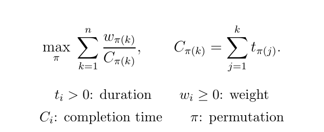

# ARP-Greedy

An experimental Python library with a C++ core for the airplane refueling
problem, written as a scheduling problem:



The greedy algorithm constructs a local optimum under adjacent swaps and has
a **1/3-approximation guarantee**. A decremental convex hull gives **O(n log n)**
arithmetic operations.

## Install

Requires Python >= 3.10, a C++17 compiler, CMake >= 3.20 and Boost >= 1.74 headers.
Not yet published to PyPI. Run in your chosen Python environment:

```sh
git clone https://github.com/DR-LLL/ARP-Greedy.git
cd ARP-Greedy
python -m pip install .
```

## Use

```python
from arp_greedy import schedule

# Each pair is (duration, weight). Lists and finite iterators both work.
tasks = [(1, 1), (2, 8)]
result = schedule(tasks)

# Apply the returned indices to the original tasks.
planned_tasks = [tasks[i] for i in result.order]

print(result.order)       # (1, 0) means the second task goes first.
print(planned_tasks)      # [(2, 8), (1, 1)]
print(result.objective)   # 4.333333333333333 is the objective value.
```

The input is unchanged. Times must be positive and weights nonnegative.
Both must be finite. Inputs are converted to Python floats.
The result is a job execution order. Aircraft departure order is reversed.

MIT licensed. See [third-party notices](THIRD_PARTY_NOTICES.md).
